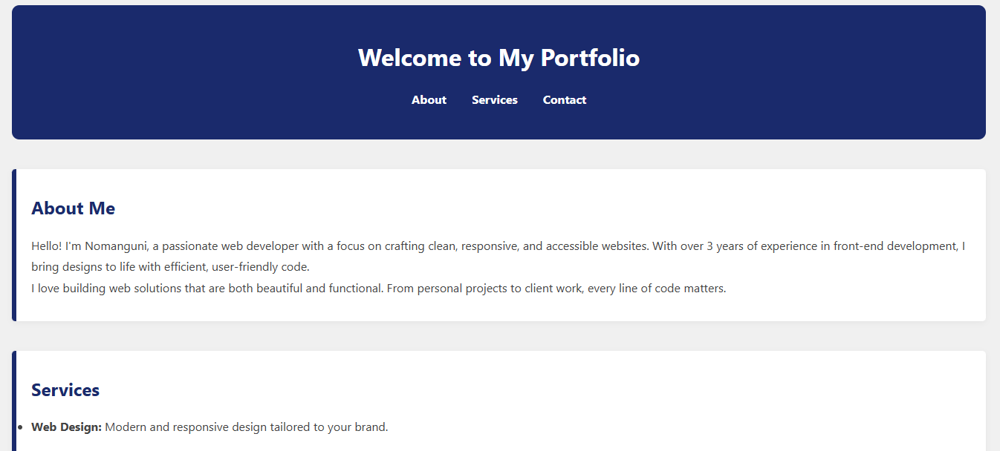

# **My Basic Website**

A simple and clean personal portfolio website built using HTML and CSS.  
This project features a navy blue and grey theme, a responsive layout, and clearly structured content for showcasing your services and contact info.

---

## 📸 Screenshot



## 🎨 Theme

- **Primary Color:** Navy Blue (`#1a2a6c`)
- **Secondary Color:** Light Grey (`#f0f0f0`)
- **Text Color:** Dark Grey (`#444`)
- **Accent:** White and border highlights

---

## 💻 Features

- Clean responsive layout
- Sectioned content (About, Services, Contact)
- Hover effects on navigation links
- SEO-friendly structure
- Easy to customize for personal branding

---

## 🛠️ Technologies Used

- **HTML5** – semantic, well-structured content
- **CSS3** – custom styles with modern design and layout
- Responsive and accessible techniques

---

## 🚀 Getting Started

To view the website locally:

### 1. Download or clone this repository:
   ```
   git clone https://github.com/Nomahk25/my-basic-website
   ```
### 2. Open index.html in your browser.

### 3. To customize, update text/images in index.html and styles in style.css

## 🧠 Ideas for Enhancement

- Add a project showcase section with images and links
- Add a contact form (using Formspree or Netlify Forms)
- Integrate a blog/news section
- Add dark/light mode toggle

## 👩‍💻 Author

Nomanguni Khumalo
📍 Johannesburg, South Africa
📧 nomangunik25@gmail.com

## 💡 Inspiration

A clean and modern personal website to represent professional experience and passion for front-end development.

## 🤝 Contributing

Feel free to fork the project, improve it, and submit pull requests!

Ideas:

- Add animations or transitions
- Optimize for SEO
- Translate into multiple languages

## 📄 License

This project is open source and free to use under the MIT License.
